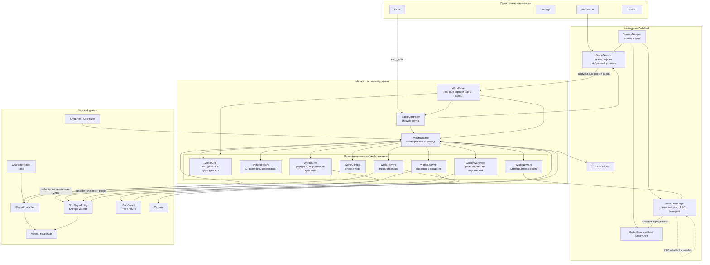
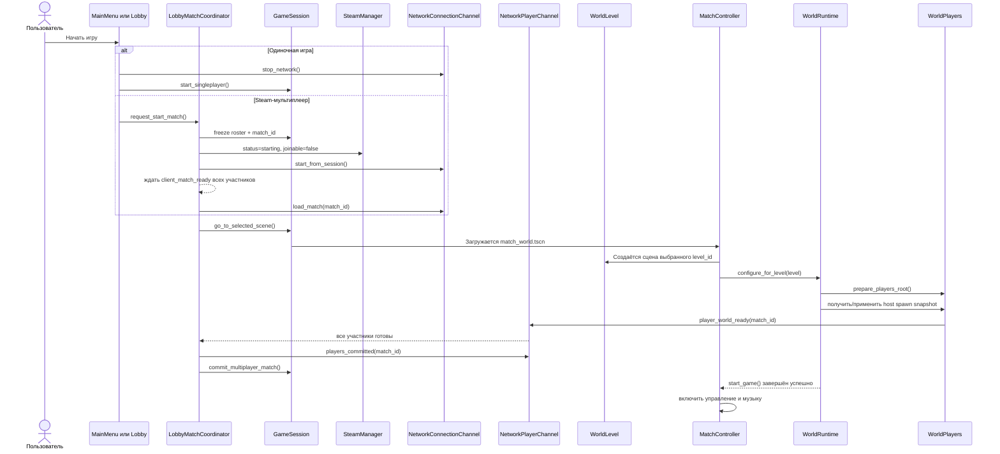
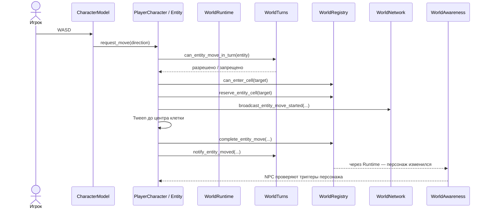
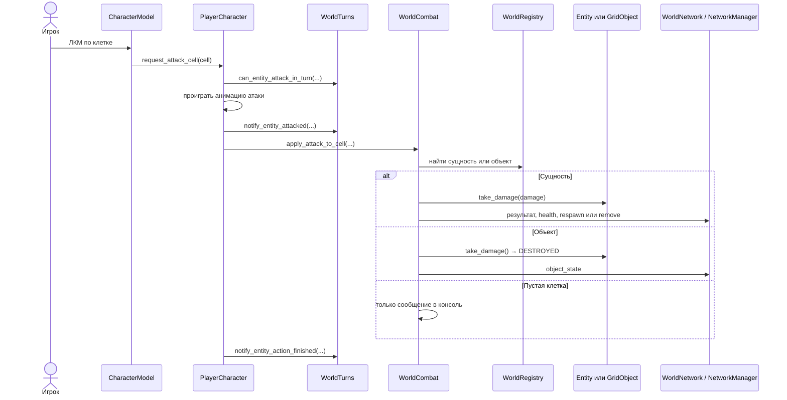
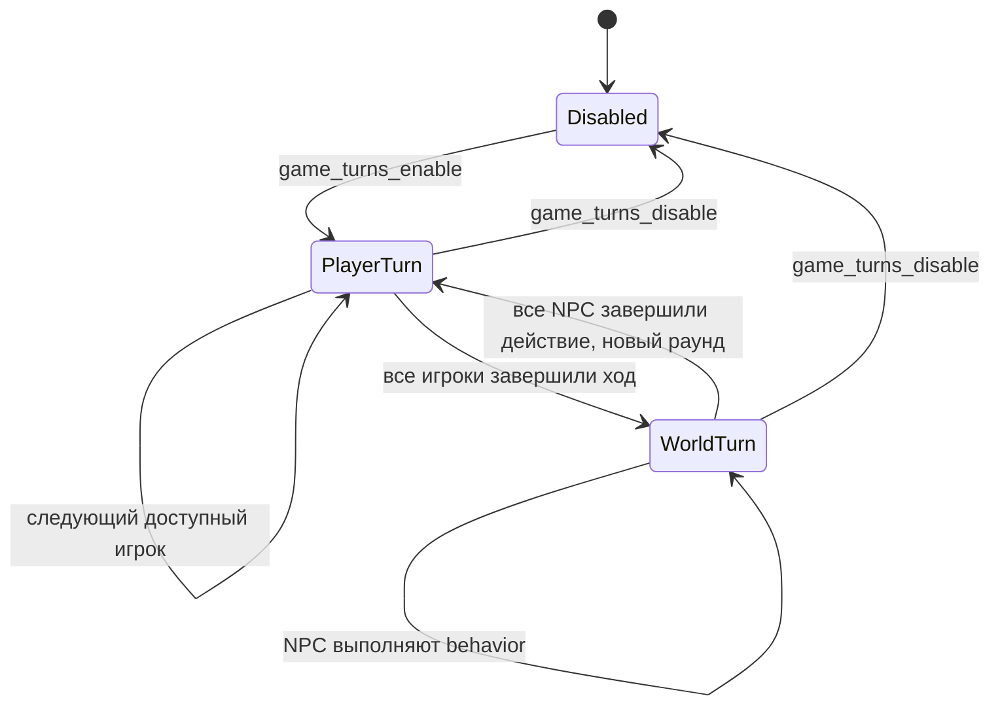
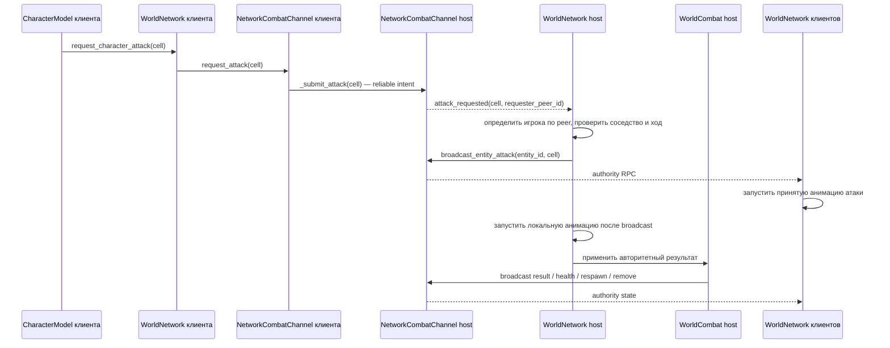
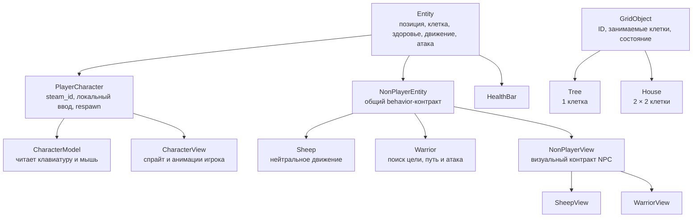

# DragonStride: путеводитель по проекту и архитектуре

Этот документ предназначен для разработчика, который впервые открыл проект. Он описывает не только целевую архитектуру из `AGENTS.md`, но и фактически реализованное поведение текущего кода.

Актуальность описания: состояние рабочей копии на 16 июля 2026 года. Проект использует Godot 4.6 и GDScript.

## 1. Что это за проект

DragonStride сейчас представляет собой двухмерную игру на клеточной карте. Игрок управляет персонажем, перемещается по проходимым клеткам, атакует соседние клетки, сущности и объекты. Игра поддерживает одиночный режим и Steam-мультиплеер с лобби. Дополнительно существует включаемый через консоль пошаговый режим, в котором игроки и мир действуют по очереди.

Общая игровая оболочка — `scenes/world/match_world.tscn`. Сцена `scenes/sandbox/sandbox.tscn` создана исключительно как песочница для проверки функциональности, воспроизведения и исправления ошибок; она не является production-уровнем. Меню, сессия, сетевое соединение и жизненный цикл матча находятся вне данных карты.

## 2. Короткая ментальная модель

Если запомнить только пять понятий, пусть это будут они:

1. `GameSession` знает, какой режим запущен, кто участвует и какой уровень выбран.
2. `WorldLevel` хранит состав конкретной карты: тайлы, размещённые объекты, точки появления и визуальные узлы.
3. `MatchController` запускает и завершает матч.
4. `WorldRuntime` — единый типизированный вход из gameplay-кода в возможности мира.
5. Профильные `World*`-сервисы выполняют конкретную работу: сетка, регистрация, бой, ходы, создание объектов, сеть и реакции AI.

Упрощённая формула взаимодействия:

```text
ввод игрока → Entity / CharacterModel → WorldRuntime → профильный World-сервис
                                                    ↓
                                            изменение мира
                                                    ↓
                                      View / HUD и, при необходимости, сеть
```

## 3. Основные возможности проекта на данный момент

### 3.1. Запуск приложения и меню

- Приложение стартует со сцены главного меню `scenes/menu/main_menu/main_menu.tscn`.
- Из главного меню можно запустить одиночную игру, перейти в Steam-лобби, открыть настройки или выйти.
- Экран настроек позволяет выбрать одно из пяти разрешений окна и центрирует окно на экране.
- Кнопка завершения в игровом HUD заканчивает матч и возвращает в главное меню.

### 3.2. Игровая сессия

- Поддерживаются состояния: сессии нет, одиночная игра, multiplayer-host и multiplayer-client.
- В сессии хранятся выбранный `level_id`, lobby ID, Steam ID хоста и локального игрока, `match_id`, revision roster, список игроков и настройки матча.
- Multiplayer-сессия сначала provisional и становится committed только после готовности transport, загрузки мира и синхронизации всех игроков.
- Frozen roster сортируется по Steam ID. Host детерминированно назначает `player_1`, `player_2` и далее; имя игрока не является идентификатором.
- Для одиночной игры создаётся один локальный игрок `Patrick`.
- Для мультиплеера список игроков строится по участникам Steam-лобби.
- Уровень выбирается по разрешённому `level_id`; каталог содержит тестовую песочницу `sandbox` и уровень `level_1`.

### 3.3. Steam-лобби

- Инициализация Steam и relay network.
- Создание публичного лобби максимум на четыре участника.
- Поиск только ожидающих лобби DragonStride.
- Вход и выход из лобби.
- Отображение состава лобби, владельца и локального пользователя.
- Запуск матча владельцем лобби.
- `LobbyMatchCoordinator` координирует подготовку, transport, загрузку сцены, world readiness и отмену запуска.
- Управляющие сообщения Steam lobby chat принимаются только от актуального владельца lobby.
- При старте lobby получает `status = starting` и `joinable = false`; late join и reconnect после фиксации roster не поддерживаются.

### 3.4. Сетевой transport

- Создание `SteamMultiplayerPeer` для host и client.
- Сопоставление Godot `peer_id` со Steam ID с проверкой Steam identity, полученной непосредственно от transport, и текущего состава лобби.
- Передача состояния персонажей, атак, движения NPC, здоровья, смерти/возрождения, состояний AI и объектов.
- Синхронизация пошагового состояния.
- Сетевое создание разрешённых сущностей и объектов.
- Кэширование авторитетных состояний объектов, AI и созданных во время матча объектов для resync уже подключённых участников.
- Завершение host-матча использует уникальный `end_id`, ACK от верифицированных peers и timeout 3 секунды перед локальным teardown.
- Разделение часто обновляемого состояния персонажа (`unreliable`) и одноразовых игровых событий (`reliable`).

### 3.5. Уровень и жизненный цикл матча

- Конкретный уровень задаёт размер сетки, имена проходимых TileMap-слоёв и точки появления игроков.
- `MatchController` настраивает runtime, запускает матч после готовности дерева сцены, включает музыку и завершает матч.
- При завершении матча останавливается музыка, проигрывается звук смерти, закрывается активная multiplayer-сессия, очищается `GameSession` и открывается главное меню.

### 3.6. Клеточная сетка

- Размер клетки — 64 пикселя.
- Размер сетки текущего уровня по умолчанию — 18 × 18 клеток.
- Поддерживается преобразование координат мира в координаты клетки и обратно.
- Проверяются границы сетки.
- Проходимость определяется наличием тайла в разрешённом слое; сейчас основной проходимый слой — `Ground`.
- Можно получить центр текущей или соседней клетки.

### 3.7. Регистрация, занятость и резервирование клеток

- Объекты и сущности регистрируются по стабильным ID.
- Реестр хранит занятые объектами клетки.
- Реестр хранит текущие клетки сущностей.
- На время движения целевая клетка резервируется, чтобы две сущности не вошли в неё одновременно.
- Поддерживаются сущности и объекты, занимающие несколько клеток.
- Регистрация и перемещение сначала полностью валидируются и только затем атомарно изменяют реестр; duplicate ID и частичная регистрация запрещены.
- Обратные индексы хранят клетки сущности, её reservations и клетки объекта, поэтому unregister, move и respawn не сканируют весь реестр.
- Типизированный результат различает invalid ID, duplicate ID, выход за сетку, непроходимость, занятость объектом/сущностью и reservation.
- По клетке можно найти сущность, объект или человекочитаемое имя поверхности.

### 3.8. Игроки и камера

- Игроки создаются сервисом `WorldPlayers` из одной сцены персонажа.
- Одиночный игрок получает фиолетовый вариант воина.
- Multiplayer-игроки получают цвета Blue, Purple, Red и Yellow по порядку.
- Для локального игрока создаётся камера.
- Камера умеет плавно следовать за игроком и переключаться в свободный режим с перемещением у краёв экрана.
- Multiplayer authority узлов игроков назначается после построения Steam ID ↔ peer ID mapping.
- Host выбирает spawn-клетки в порядке frozen roster. Невалидная preferred cell получает детерминированный fallback по Manhattan distance, затем по `y` и `x`.
- Канал `Players` передаёт авторитетный spawn snapshot, `player_world_ready` и `players_committed`; клиент не создаёт итоговые spawn records.
- Если разместить весь roster невозможно, запуск отменяется для всех. Занятый respawn использует тот же fallback или остаётся pending без наложения сущностей.

### 3.9. Управление персонажем и движение

- Перемещение выполняется клавишами WASD по четырём ортогональным направлениям.
- Режим атаки включается клавишей Q или кнопкой с мечом; это режим по умолчанию.
- Режим взаимодействия включается клавишей E или кнопкой с открытой рукой.
- Курсор локального игрока показывает текущий режим над миром и HUD: `tool_sword_a.svg` для атаки и `hand_open.svg` для взаимодействия. При выходе из матча возвращается системный курсор.
- Сущность проверяет состояние, правила текущего хода и доступность целевой клетки.
- Перед анимацией перемещения клетка резервируется.
- Перемещение визуально выполняется Tween-анимацией.
- После завершения обновляются занятость клеток, состояние хода и реакции AI.
- При удерживании клавиши персонаж продолжает движение, пока это разрешено.
- Во время открытой консоли ввод перемещения и атаки блокируется.

### 3.10. Бой, здоровье, смерть и возрождение

- Атака выполняется левой кнопкой мыши по соседней ортогональной клетке.
- Сначала проигрывается анимация атаки, затем применяется игровой результат.
- Если на клетке находится сущность, ей наносится урон атакующего.
- Если сущности нет, но есть `GridObject`, объект переводится в уничтоженное состояние.
- Результаты атак выводятся в игровую консоль.
- Каждая сущность получает визуальную полоску здоровья.
- Обычная NPC-сущность при нулевом здоровье удаляется.
- Игрок при нулевом здоровье сразу возрождается на своей стартовой клетке с полным здоровьем.
- У сетевых клиентов синхронизируются здоровье, удаление NPC и возрождение игрока.

### 3.11. Пошаговый режим

- По умолчанию режим выключен: игра допускает свободное движение и атаки.
- В тестовой сцене `sandbox` включение и выключение выполняется консольными командами `game_turns_enable` и `game_turns_disable`.
- Состояния режима: ход игрока и ход мира.
- За ход игрок получает до 10 шагов и одну результативную атаку по сущности или объекту.
- Пустая атака не расходует доступную атаку.
- Игрок может завершить ход пробелом; если анимация ещё идёт, завершение откладывается.
- Игроки ходят в порядке, построенном из `GameSession`.
- Отключённый или отсутствующий multiplayer-игрок пропускается.
- После всех игроков начинается ход мира.
- Во время хода мира запускается `behavior()` доступных `NonPlayerEntity`.
- После завершения действий всех мировых сущностей начинается новый раунд.
- Host хранит авторитетное состояние ходов и рассылает снимки клиентам.
- Каждый переход, меняющий допустимого автора, увеличивает монотонный `turn_revision`; revision включён в turn snapshot и gameplay intents.
- Move, attack, interaction, spell cast, inventory use и end turn проверяют `match_id`, `turn_revision`, активного Steam-пользователя и отсутствие другого pending action персонажа.
- Перемещение и удаление предметов разрешены вне собственного хода; применение предметов и заклинаний в пошаговом режиме разрешено только активному игроку.

### 3.12. NPC и AI

- `NonPlayerEntity` задаёт общий контракт поведения NPC.
- Овца во время хода мира пытается двигаться в текущем горизонтальном направлении; при блокировке разворачивается.
- Вражеский воин имеет состояния `passive` и `active`.
- Воин активируется, когда живой персонаж оказывается в соседней клетке, включая диагональ.
- Активный воин сохраняет ID цели.
- Для поиска пути к клетке атаки используется обход в ширину по четырём направлениям.
- Воин учитывает границы, проходимость, объекты и, при реальном движении, текущую занятость клеток.
- За мировой ход воин делает максимум три шага и одну атаку.
- Воин возвращается в пассивное состояние, если цель исчезла, побеждена или недостижима.
- В multiplayer решения AI принимает host; клиенты воспроизводят очередь удалённых движений и атак.
- `WorldAwareness` повторно проверяет триггеры AI при регистрации и перемещении персонажей.

### 3.13. Создание сущностей и объектов в runtime

- Только в `sandbox` консольная команда `game_create <type> <x> <y>` создаёт разрешённый тип в указанной клетке.
- Каталог содержит `sheep`, `warrior`, `tree`, `house`, `meat`, `precision_stone` и `meteor_scroll`.
- До создания проверяются границы, проходимость, занятость и резервации.
- Созданным экземплярам назначается уникальный `spawn_id`.
- В multiplayer клиент отправляет запрос, host выполняет проверку и рассылает результат.
- Список созданных объектов кэшируется для поздно подключившихся клиентов.

### 3.14. Объекты мира

- Базовый `GridObject` имеет ID, список занимаемых смещений и состояния `NORMAL`/`DESTROYED`.
- Дерево занимает одну клетку.
- Дом занимает квадрат 2 × 2 клетки.
- Разрушение сейчас бинарное: первая успешная атака меняет состояние и текстуру.
- Уничтоженный объект не удаляется из реестра и продолжает занимать клетки.

### 3.15. Визуализация и вспомогательный UI

- Отрисовка сетки только над проходимыми клетками.
- Включение и выключение линий сетки через консоль.
- Подсветка клетки под курсором, если она проходима или содержит объект/сущность.
- Отдельные view-компоненты управляют спрайтами, направлением и анимациями игрока, овцы и воина.
- HUD содержит кнопку завершения игры, пять обычных слотов, кнопки атаки/взаимодействия с SVG-иконками, пять слотов заклинаний и корзину.
- Локальные gameplay-сообщения выводятся через `ConsoleOutput` в подключённый console addon.

### 3.16. Заклинания и свиток метеорита

- `WorldSpells` владеет выбором заклинания, проверкой каста, лимитами применений и созданием временных визуальных эффектов.
- Обычные предметы и заклинания хранятся в двух независимых контейнерах по пять слотов. Прототип с `inventory_kind = "spell"` не может попасть в обычный слот.
- Свиток `meteor_scroll` содержит заклинание `meteor`, остаётся в инвентаре после применения и не складывается в стек: каждый экземпляр занимает отдельный spell-слот.
- В пошаговом режиме каждый занятый spell-слот даёт одно независимое применение за ход. Индикатор `остаток/всего` конкретного слота отображается в его правом верхнем углу.
- В свободном режиме каст заклинаний запрещён. В пошаговом режиме заклинание может использовать только активный игрок в свой ход; один игрок не может запустить второй метеорит до завершения первого.
- Во время полёта и взрыва метеорита двигаться могут все игроки, кроме персонажа, который в данный момент находится в целевой клетке эффекта.
- Метеорит летит к центру выбранной клетки детерминированным `Tween`. Завершение движения является моментом удара; физические коллизии не используются.
- При ударе host заново определяет содержимое клетки, наносит сущности 50 урона либо повреждает `GridObject` через `WorldCombat`.
- `NetworkSpellChannel` принимает от клиента только индекс spell-слота и клетку. Host определяет заклинание по своему inventory snapshot и рассылает авторитетное событие каста до запуска локального VFX.
- Узел канала называется `Spells`; его имя и путь в `network_manager.tscn` являются частью версии сетевого протокола.

## 4. Общая блок-схема проекта

Сплошная стрелка означает прямой вызов или владение. Пунктирная — событие, сигнал или сетевую передачу.



Последняя петля `NetworkManager → NetworkManager` обозначает обмен между экземплярами этого autoload на разных компьютерах, а не рекурсивный локальный вызов.

## 5. Как запускается матч



`LobbyMatchCoordinator` владеет orchestration до committed-состояния, а `MatchController` — lifecycle уже загруженного мира. `WorldRuntime.start_game()` является ожидаемой операцией: ошибка spawn/synchronization отменяет provisional-сессию и возвращает группу в lobby.

## 6. Как проходит действие игрока

### 6.1. Движение



### 6.2. Атака



## 7. Машина состояний пошагового режима



В `PlayerTurn` активен один игрок, у которого есть 10 шагов и одна результативная атака. В `WorldTurn` игроки не управляют персонажами, а host или одиночная игра запускает поведение всех доступных NPC.

## 8. Сетевой путь атаки: роль host и фактический поток



Клиентский attack intent содержит только целевую клетку. Host сам определяет персонажа по зарегистрированному `requester_peer_id`; клиентская анимация начинается только после получения `entity_attack` от host. Для взаимодействий сначала отправляется `interaction` intent и только затем host применяет действие. Для заклинаний host рассылает принятый cast result до запуска VFX. Один и тот же порядок «сеть, затем визуал» применяется также к авторитетным атакам NPC.

Для непрерывного положения персонажей используется другой путь: клиент отправляет `character_state` в режиме `unreliable`, host проверяет соответствие отправителя Steam ID и допустимость синхронизации в текущем ходу, затем ретранслирует состояние.

## 9. Иерархия игровых типов



Стрелка на этой схеме читается как «базовый блок → специализация или принадлежащий компонент».

## 10. Все основные инкапсулированные блоки

### 10.1. Приложение, сессия и transport

| Блок | Где находится | Что инкапсулирует |
|---|---|---|
| `MainMenu` | `scenes/menu/main_menu/` | Навигацию из главного меню, запуск одиночной сессии и переход к lobby/settings. |
| `Settings` | `scenes/menu/settings/` | Выбор разрешения, оконный режим и центрирование окна. |
| `LobbyMain` | `scenes/menu/lobby/lobby_main.gd` | Выбор между созданием и поиском Steam-лобби. |
| `LobbyHost` | `scenes/menu/lobby/lobby_host.gd` | Экран состава лобби, host-controls и запуск игры владельцем. Этим же экраном пользуется вошедший клиент. |
| `LobbyJoin` | `scenes/menu/lobby/lobby_join.gd` | Запрос списка лобби, отображение результатов и подключение. |
| `LobbyMatchCoordinator` | `scenes/multiplayer/lobby_match_coordinator.gd` | Состояния подготовки матча, timeout, frozen roster, переходы между lobby и миром и commit/cancel orchestration. Не содержит Steam API или RPC. |
| `GameSession` | `scenes/multiplayer/game_session.gd` | Режим игры, `match_id`, provisional/committed-состояние, выбранную сцену, frozen roster, Steam IDs и настройки матча. Не хранит правила мира. |
| `SteamManager` | `scenes/multiplayer/steam_manager.gd` | Внешний Steam lobby API, relay readiness, участников, lobby status/joinable и проверку автора lobby-команд. |
| `NetworkManager` | `scenes/multiplayer/network_manager.tscn` | Composition root transport, peer registry, replication store и профильных `Network*Channel`. RPC находятся только в каналах. |
| `NetworkPlayerChannel` | `scenes/multiplayer/channels/network_player_channel.gd` | Авторитетный player spawn snapshot, запрос snapshot, world readiness, players commit и pending-respawn состояние. Фиксированное сетевое имя узла — `Players`. |
| `Console` addon | `addons/console/` | Внешнюю игровую консоль и регистрацию команд. Это сторонний код; без отдельной задачи его не изменяют. |
| `ConsoleOutput` | `scenes/console/console_output.gd` | Маленькую границу между gameplay-сообщениями и внешним console addon. |

### 10.2. Уровень, lifecycle и runtime

| Блок | Где находится | Что инкапсулирует |
|---|---|---|
| `WorldLevel` | `scenes/world/world_level.gd` | Данные конкретной карты и типизированный доступ к корням/узлам уровня. |
| `match_world.tscn` | `scenes/world/match_world.tscn` | Общую оболочку матча: сервисы, runtime, controller, Players, audio, HUD и контейнер выбранного уровня. |
| `sandbox.tscn` | `scenes/sandbox/sandbox.tscn` | Песочницу для проверки функциональности и воспроизведения ошибок: Water/Ground/Clouds, размещённые House/Tree/Sheep/Warrior и разрешённые debug-команды. Не является production-уровнем. |
| `MatchController` | `scenes/world/match_controller.gd` | Загрузку выбранного уровня, запуск/завершение матча, runtime-signals, музыку и переход в меню. |
| `WorldRuntime` | `scenes/world/world_runtime.gd` | Устойчивый API мира для сущностей и компонентов. Связывает загруженный уровень с общими сервисами. |
| `WorldGrid` | `scenes/world/services/world_grid.gd` | Размер и координаты сетки, границы, размер клетки и проходимые TileMap-слои. |
| `WorldRegistry` | `scenes/world/services/world_registry.gd` | ID, регистрацию, занятые и зарезервированные клетки, поиск сущностей/объектов и проверку размещения. |
| `WorldPlayers` | `scenes/world/services/world_players.gd` | Создание игроков, spawn cells, цвета, локального игрока, камеру и multiplayer authority. |
| `WorldCombat` | `scenes/world/services/world_combat.gd` | Выбор цели в клетке, применение урона, повреждение объектов и формирование результата боя. |
| `WorldTurns` | `scenes/world/services/world_turns.gd` | Состояние раунда/хода, порядок игроков, лимиты действий, мировой ход и сетевые snapshots. |
| `WorldSpawner` | `scenes/world/services/world_spawner.gd` | Каталог разрешённых типов, проверку размещения, создание, ID и сетевую репликацию runtime-spawn. |
| `WorldSpells` | `scenes/world/services/world_spells.gd` | Выбор и применение заклинаний, лимиты свитков за ход и orchestration временных spell-эффектов. |
| `WorldAwareness` | `scenes/world/services/world_awareness.gd` | Уведомление NPC о появлении и изменении положения персонажей; решения конкретного AI остаются в NPC. |
| `WorldNetwork` | `scenes/world/services/world_network.gd` | Перевод сетевых сигналов в операции текущего уровня и доменных событий в вызовы `NetworkManager`. |

### 10.3. Сущности, модели и представления

| Блок | Где находится | Что инкапсулирует |
|---|---|---|
| `Entity` | `scenes/entities/entity/entity.gd` | Общие характеристики сущности: ID, имя, тип, health/damage, клетку, движение, атаку, смерть и health bar. |
| `PlayerCharacter` | `scenes/entities/character/character.gd` | Состояние игрока, Steam ID, remote state, цвет, анимацию атаки и особое возрождение вместо удаления. |
| `CharacterModel` | `scenes/entities/character/character_model.gd` | Пользовательский ввод, продолжение движения, отправку сетевого состояния и запрос завершения хода. |
| `CharacterView` | `scenes/entities/character/character_view.gd` | Цветной спрайт игрока, направление взгляда и анимации idle/walk/attack. |
| `NonPlayerEntity` | `scenes/entities/non_player_entity/non_player_entity.gd` | Общий gameplay-контракт NPC, behavior, remote move/attack и уведомление о завершении действия. |
| `NonPlayerView` | `scenes/entities/non_player_entity/non_player_view.gd` | Общий визуальный контракт NPC без игровых решений. |
| `Sheep` | `scenes/entities/sheep/sheep.gd` | Нейтральную NPC с 25 HP и простым горизонтальным поведением. |
| `SheepView` | `scenes/entities/sheep/sheep_view.gd` | Спрайт овцы, направление и idle/walk-анимации. |
| `Warrior` | `scenes/entities/enemies/warrior/warrior.gd` | Вражеский AI, цель, BFS-путь, лимиты мирового хода, атаку и воспроизведение сетевых действий. |
| `WarriorView` | `scenes/entities/enemies/warrior/warrior_view.gd` | Направление, idle/run/guard и двухчастную анимацию атаки воина. |
| `HealthBar` | `scenes/entities/health_bar/health_bar.tscn` | Визуальную полоску здоровья, автоматически добавляемую каждой `Entity`. |

### 10.4. Объекты и визуальные компоненты мира

| Блок | Где находится | Что инкапсулирует |
|---|---|---|
| `GridObject` | `scenes/objects/grid_object/grid_object.gd` | Общий контракт статического клеточного объекта: ID, occupied offsets, normal/destroyed state и текстуры. |
| `Tree` | `scenes/objects/tree/` | Одноклеточную специализацию `GridObject`. |
| `House` | `scenes/objects/house/` | Специализацию `GridObject`, занимающую четыре клетки 2 × 2. |
| `Camera` | `scenes/camera/` | Follow/free режимы камеры и консольные команды переключения. |
| `GridLines` | `scenes/grid_lines/` | Отрисовку границ проходимых клеток и команды show/hide. |
| `CellHover` | `scenes/cell_hover/` | Подсветку доступной для взаимодействия клетки под мышью. |
| `HUD` | `scenes/hud/` | Ввод интерфейса матча; сейчас только сигнал запроса завершения игры. |

## 11. Кто какими данными владеет

| Данные | Владелец | Почему именно он |
|---|---|---|
| Режим, выбранный уровень, список игроков | `GameSession` | Эти данные живут дольше одной сцены уровня и описывают сессию. |
| Тайлы, spawn cells, визуальные узлы карты | `WorldLevel` / `.tscn` | Это содержание конкретного уровня. |
| Ссылки на сервисы текущего уровня | `WorldRuntime` | Он является общей точкой доступа к runtime-возможностям. |
| Размер клетки, границы, проходимость | `WorldGrid` | Это единая предметная область сетки. |
| ID и занятость клеток | `WorldRegistry` | Один источник истины предотвращает конфликты движения и размещения. |
| Раунд, активный игрок, шаги и атаки | `WorldTurns` | Это состояние пошаговых правил. |
| Health, damage, текущая клетка конкретной сущности | `Entity` | Это собственное игровое состояние сущности. |
| Состояние passive/active и цель воина | `Warrior` | Это специализированное поведение конкретного AI. |
| Normal/destroyed конкретного объекта | `GridObject` | Это собственное состояние объекта. |
| Steam lobby state | `SteamManager` | Это граница внешнего Steam API. |
| Peer mapping, RPC и сетевые кэши | `NetworkManager` | Это transport-уровень, общий между сценами. |
| Применение сетевого события к узлам уровня | `WorldNetwork` | Только этот адаптер одновременно знает домен уровня и сигналы transport. |

## 12. Карта каталогов

```text
project.godot                  настройки проекта, autoload и Input Map
AGENTS.md                      обязательные архитектурные правила разработки
PROJECT_GUIDE_RU.md            этот вводный документ

scenes/
  menu/                        главное меню, настройки, Steam lobby UI
  multiplayer/                 GameSession, SteamManager, NetworkManager
  world/                       общая оболочка матча, runtime, lifecycle и World-сервисы
  sandbox/                     тестовая сцена и конфигурация sandbox
  levels/                      дополнительные сцены и конфигурации уровней
  entities/
    entity/                    базовая Entity
    character/                 игрок: model + view + scene
    non_player_entity/         базовые контракты NPC и NPC-view
    sheep/                     нейтральная овца
    enemies/warrior/           вражеский воин и AI
    health_bar/                визуальное здоровье
  objects/
    grid_object/               базовый объект сетки
    tree/                      дерево
    house/                     дом
  camera/                      камера локального игрока
  grid_lines/                  визуальные линии клеток
  cell_hover/                  подсветка клетки
  hud/                         HUD матча
  console/                     адаптер вывода в консоль

addons/console/                внешний console addon
addons/godotsteam/             внешняя интеграция GodotSteam
art/                           графические ресурсы Tiny Swords
fonts/                         шрифты и лицензии
```

`.godot/` — генерируемый кэш редактора. Его не следует читать как исходный код, редактировать или включать в ручные изменения.

## 13. Где искать код для типичных задач

| Если нужно изменить… | Начать с | Затем проверить |
|---|---|---|
| Размер сетки или проходимость | `WorldLevel`, `WorldGrid` | TileMap-слои конкретного `.tscn`. |
| Занятость клеток | `WorldRegistry` | `Entity.occupied_offsets`, `GridObject.occupied_offsets`. |
| Правила перемещения | `Entity`, `WorldTurns` | `WorldRegistry.can_enter_cell()`, network replay. |
| Управление игроком | `CharacterModel` | `PlayerCharacter` и Input Map в `project.godot`. |
| Урон и выбор цели | `WorldCombat` | `Entity.take_damage()`, `GridObject.take_damage()`, `WorldNetwork`. |
| Раунды и лимиты действий | `WorldTurns` | `NetworkManager` turn RPC и NPC `behavior()`. |
| Поведение конкретного NPC | Скрипт NPC, например `warrior.gd` | `NonPlayerEntity`, `WorldAwareness`, `WorldTurns`. |
| Создание нового runtime-объекта | `WorldSpawner.CATALOG` | Новая scene, базовый `Entity` или `GridObject`, network cache. |
| Создание нового уровня | Новый `WorldLevel`-совместимый `.tscn`, level-скрипт и `LevelDefinition.tres` | Каталог `GameSession`; Runtime/Controller/сервисы предоставляет общий `match_world.tscn`. |
| Lobby и запуск матча | `LobbyMatchCoordinator` и `scenes/menu/lobby/` | `SteamManager` для lobby API, `GameSession` для frozen roster, connection/player channels для протокола. |
| RPC или delivery mode | `NetworkManager` | Доменное применение события в `WorldNetwork`. |
| Анимацию игрока | `CharacterView` и `character.tscn` | Не переносить туда combat/turn/network rules. |
| Анимацию NPC | Конкретный view | Базовый контракт `NonPlayerView`. |
| Завершение матча | `MatchController` | HUD-сигнал и сетевой end-game flow. |
| Игровое сообщение | `ConsoleOutput` | Не отправлять текст локального лога по сети. |

## 14. Архитектурные границы, которые нельзя нарушать

### `WorldLevel` — карта, а не приложение

Не помещайте в корневой скрипт уровня запуск сессии, правила боя, AI, transport или переходы меню. Уровень должен оставаться заменяемым набором данных и узлов.

### `MatchController` — только lifecycle

Он может начать и закончить матч, управлять связанными с lifecycle эффектами и переходом сцены. Он не должен вычислять проходимость, урон, AI или занятость клеток.

### `WorldRuntime` — фасад, а не склад всей логики

Сущности обращаются к миру через него, но реализация остаётся в профильных сервисах. Новая операция добавляется в runtime только если это устойчивая возможность мира, нужная потребителям.

### Gameplay не должен владеть transport

RPC размещаются в `NetworkManager`. `WorldNetwork` адаптирует сетевые события к объектам уровня. Entity, View, HUD и GridObject не должны напрямую добавлять `@rpc`.

### View ничего не решает

View показывает спрайт, направление и анимацию. Он не выбирает цель, не списывает шаг, не наносит урон и не отправляет сеть.

### Host проверяет намерения клиента

Клиент не должен назначать окончательный урон, health, spawn record, AI state или turn snapshot. Для любого нового `@rpc("any_peer")` host обязан проверять роль и отправителя.

### Логи остаются локальными

Нельзя передавать по сети строки logger-функций, stack traces, пути, object dumps или сырые ошибки SDK. По сети идут только данные игрового протокола и ограниченные безопасные причины состояния.

## 15. Важные детали текущей реализации

Эти особенности легко принять за баг, если о них не знать:

- Пошаговый режим не включается автоматически. В `sandbox` он включается командой `game_turns_enable`; production-уровень должен включать его через настройки или orchestration матча, а не через консоль.
- Атака разрешена только по ортогонально соседней клетке; диагональная атака невозможна.
- Триггер активности вражеского воина, напротив, учитывает восемь соседних клеток, включая диагонали.
- Уничтоженный дом или дерево меняет вид, но остаётся препятствием.
- После смерти игрок возвращается на фактически свободную spawn/fallback cell. Если клетки временно нет, игрок скрыт, исключён из registry и ожидает безопасного respawn.
- Обычный NPC после смерти удаляется.
- В мировой ход все готовые NPC получают запуск `behavior()`; завершение мирового хода ждёт, пока каждый сообщит о завершении.
- `sandbox.tscn` уже содержит House, Tree и Sheep; в этой песочнице runtime дополнительно может создавать тестовые сущности и объекты.
- Единственная проходимая поверхность по умолчанию — TileMap-слой `Ground`; `Water` не считается проходимым.
- Сетка логически ограничена `grid_size`, даже если в TileMap нарисованы тайлы за этими границами.

## 16. Текущие ограничения и зоны риска

Это не список требований на немедленную переделку, а ориентир для понимания зрелости проекта:

- UI выбора уровня пока не добавлен; `GameSession` предоставляет каталог и программный выбор по `level_id`.
- Runtime-spawner ограничен явным `WorldSpawner.CATALOG` и не является универсальным редактором карты.
- Объекты имеют только бинарное состояние цел/уничтожен и не имеют числового здоровья.
- Клиентские gameplay-команды являются intents. Host получает автора из верифицированного peer registry, повторно проверяет клетку, цель, здоровье и turn-budget перед выполнением и рассылает авторитетный результат.
- Action stream ограничен одной внешней pending-командой на персонажа, очередями 64/256, token bucket 8 intents/секунду с burst 12 и окном deduplication 256 request ID на Steam ID.
- Late join и reconnect намеренно не входят в текущий протокол: после фиксации roster новый transport peer отключается.
- Часть старых UI/Steam-скриптов использует вывод типов `:=` и широкие `Array`/`Dictionary`. Правила `AGENTS.md` требуют явных типов для нового и изменяемого кода, но не требуют переписывать нетронутый legacy-код только ради стиля.

## 17. Консольные команды проекта

Все перечисленные проектные команды регистрируются только в `sandbox`. В других уровнях они отсутствуют. Связанные с ними сетевые debug mutation intents дополнительно отклоняются host, если текущий уровень не разрешает `allows_debug_commands`.

| Команда | Назначение |
|---|---|
| `game_turns_enable` | Включить пошаговый режим; в multiplayer доступно только host. |
| `game_turns_disable` | Выключить пошаговый режим; в multiplayer доступно только host. |
| `game_turns_status` | Показать состояние, раунд, активного игрока и оставшиеся действия. |
| `game_create <type> <x> <y>` | Создать разрешённую сущность или объект, включая `meteor_scroll`, в клетке. |
| `game_create_full <type>` | Заполнить доступные клетки разрешённым тестовым типом. |
| `game_clear_full [type]` | Удалить созданные тестовые сущности и объекты выбранного типа или всех типов. |
| `game_character_kill` | Убить и немедленно возродить локального персонажа для проверки lifecycle. |
| `game_inventory_add <item_id> <amount>` | Добавить обычный предмет или свиток, включая `meteor_scroll`, в соответствующий контейнер локального игрока. |
| `game_camera_mode_follow` | Камера плавно следует за локальным персонажем. |
| `game_camera_mode_free` | Камера двигается при приближении курсора к краям экрана. |
| `game_grid_lines_show` | Показать линии проходимых клеток. |
| `game_grid_lines_hide` | Скрыть линии клеток. |

## 18. Термины для новичка

- **Scene (`.tscn`)** — сохранённое дерево узлов Godot. Может быть уровнем, персонажем, объектом или UI-экраном.
- **Node** — один элемент дерева сцены с состоянием и поведением.
- **Autoload** — глобальный узел, который существует при смене сцен. В проекте это `SteamManager`, `GameSession`, `NetworkManager` и `Console`.
- **Runtime** — объекты и состояние, существующие во время запущенного матча.
- **Service** — узел с одной специализированной ответственностью, например сетка или реестр.
- **Facade** — стабильная точка входа, скрывающая детали нескольких сервисов; здесь это `WorldRuntime`.
- **Entity** — подвижный игровой участник с health, damage, клеткой и действиями.
- **GridObject** — статический объект, занимающий одну или несколько клеток.
- **Authority** — сторона, имеющая право окончательно менять общее состояние. Для мира, AI, боя, spawning и ходов это host.
- **Signal** — слабосвязанное событие Godot: отправитель сообщает о случившемся, не управляя внутренностями получателя.
- **RPC** — вызов метода на другом участнике сетевой игры.
- **Reliable** — сообщение должно быть доставлено и подходит для одноразовой команды/результата.
- **Unreliable** — устаревший пакет можно потерять; подходит для часто обновляемого положения.

## 19. Рекомендуемый порядок знакомства с кодом

1. Открыть `project.godot` и увидеть main scene, autoload и Input Map.
2. Посмотреть дерево тестовой сцены `sandbox.tscn`, не углубляясь в большие данные TileMap.
3. Прочитать `world_level.gd`, `match_controller.gd` и `world_runtime.gd`.
4. По очереди изучить `WorldGrid`, `WorldRegistry`, `WorldPlayers`, `WorldCombat` и `WorldTurns`.
5. Пройти цепочку `CharacterModel → PlayerCharacter → Entity → WorldRuntime`.
6. Изучить `NonPlayerEntity`, затем простую `Sheep` и только после этого большой `Warrior` AI.
7. Для multiplayer читать в порядке `GameSession → SteamManager → NetworkManager → WorldNetwork`.
8. В конце посмотреть views, HUD, camera, grid visualization и menu UI: они проще, когда понятен домен.

Такой порядок движется от владельцев жизненного цикла и данных к деталям поведения и помогает не принять конкретную сцену уровня за архитектурный центр всего приложения.

## 20. Сетевой протокол версии 2

Текущая сборка использует `NetworkProtocol.PROTOCOL_VERSION = 2`. Версия записывается в данные lobby, проверяется в `prepare_match`, transport identity handshake и action snapshot. Lobby другой версии отфильтровывается при поиске, а прямое подключение завершается с безопасной причиной `protocol_mismatch` до загрузки уровня. Совместимость со сборками protocol v1 не поддерживается.

### Ограниченная доставка и resync

Host присваивает каждому action монотонный `sequence_id`. Клиент хранит не более 64 будущих sequence buckets, не более 32 профильных сообщений на sequence и не более 256 отложенных профильных сообщений всего. Пакеты ниже `next_remote_sequence_id` сразу отбрасываются; пакет дальше окна 64 запускает синхронизацию вместо роста памяти.

Пропущенный lifecycle или профильный payload ожидается не более 2 секунд, terminal `completed/cancelled` — не более 5 секунд. Initial snapshot повторно запрашивается каждые 500 мс и должен прийти за 8 секунд. Runtime resync ждёт безопасную action boundary до 35 секунд. На один обнаруженный разрыв выполняется один ограниченный цикл resync; при неустранимой ошибке выходит только проблемный клиент, а host продолжает матч.

Snapshot создаётся host только между actions и содержит frozen roster hash, action boundary, entity cells/vitality, объекты, inventories с revisions, turn state, spell usage, dynamic spawns, removals и AI state. Он ограничен 512 KiB, делится максимум на 16 chunks по 48 KiB и применяется только после полной сборки и проверки SHA-256. Реестр клеток изменяется через atomic batch; конфликт не должен оставлять частично применённую раскладку.

### Disconnect policy

Отключение клиента не меняет frozen roster. Его персонаж остаётся видимым, зарегистрированным, занимает клетку и может получать damage, но становится инертным и не получает управление. Ещё не начатые действия отменяются с `actor_disconnected`, начатое действие доходит до единственного authoritative terminal, а последующие ходы игрока пропускаются. Late join и reconnect по-прежнему запрещены.

### Транзакции и асинхронные callbacks

Inventory intents передают `expected_inventory_revision`. Host проверяет revision при приёме и непосредственно перед выполнением; успешная операция увеличивает её ровно один раз. Add/move/delete/use формируют mutation plan, а ошибка восстанавливает исходный inventory. Item use откатывает также изменяемое effect state. При `stale_inventory` владелец получает свежий authoritative snapshot.

Meteor использует уникальный `cast_id`: отмена до impact освобождает reservation и spell use, а произошедший impact наносит damage ровно один раз и не откатывается из-за таймаута анимации. Каждый мировой ход получает `world_turn_generation`; запоздалый NPC callback другой generation игнорируется. Watchdog одного NPC равен 8 секундам, всего world turn — 32 секундам, `BLOCKING_EVENT` — 10 секундам.

### Лимиты payload и replication cache

Строковые ID и display name ограничены 64 символами, roster — четырьмя участниками, обычный intent — 8 KiB, world records — 512 записями. Входящие данные проверяются по типу, диапазону, `match_id`, размеру и verified sender до передачи World-сервису. По сети отправляются только причины из whitelist; локальные ошибки и пути остаются в диагностике.

`NetworkReplicationStore` хранит состояние в keyed dictionaries и заменяет запись того же ID без роста массива. Removal удаляет связанные spawn/object/AI/vitality records. Store и все sequence/snapshot/request caches очищаются при cancel, match end, host loss и смене `match_id`. Для наблюдения доступны только агрегированные локальные счётчики; логирование каждого packet/frame запрещено.


 Хочу начинать создавать базовый ui шаблон для игры. Что необходимо отображать на экране. (Каждый пункт можно разделить на отдельные итерации)
 1. Иконка игрока, а также его характеристики - здоровье и урон.
 2. Какой раунд (день) идет сейчас. Раунд - это полный цикл все ходов игроков и мира по очереди.
 3. Какой игрок ходит прямо сейчас и сколько ходов ему остается в течение его хода.
 4. Чтобы показывался радиус клеток, до какой игрок, который ходит, может дойти. Например все доступные для него клетки будут иметь яркий желтый контур.
 5. Окно, которое выезжает справа от экрана и его можно будет опять же сворачивать и оно будет уезжать за экран.
	 1. В этом окне показаны иконки и характеристики всех игроков в мультиплеере. А также подсвечивается тот игрок, который совершает ход.